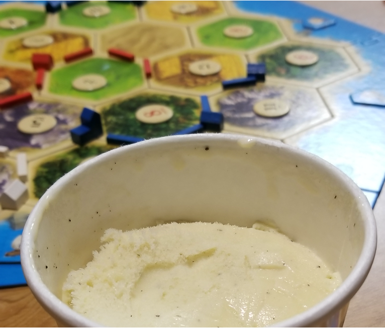
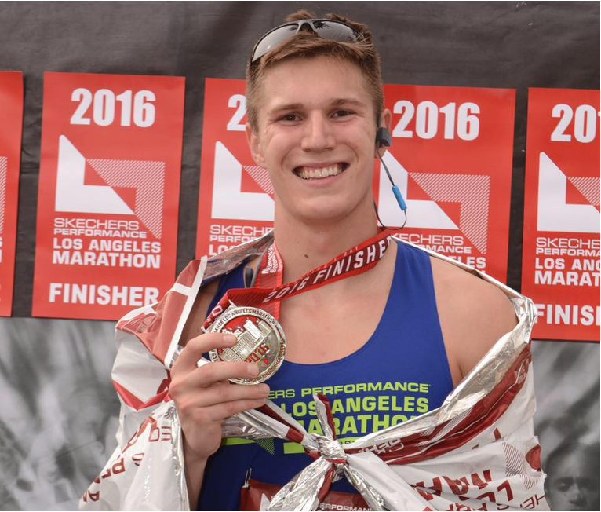

Durham, NC | lannersq@gmail.com

---

- [Research & Projects](pages/research_and_projects.html)
- [Education & Work Experience](pages/education_and_work_experience.html)
- [Résumé](quinn_lanners_cv.pdf)
- [Blog](https://medium.com/@lannersq)
- [Git](https://github.com/qlanners)
- [LinkedIn](https://www.linkedin.com/in/quinn-lanners/)

---

# About Me
My formal background is in mathematics, with a BS in applied math from [Loyola Marymount University in Los Angeles](https://www.lmu.edu/). 
Originally a pre-med student, I enjoy the medical field, but found myself much more interested in the analytical aspects of care.
I have spent the past several years enhancing my technology skills, with an emphasis on natural language processing (NLP). 
My career goals revolve around building data science and machine learning solutions in the field of health care. 
As I pursue a graduate degree, I want to conduct research at the intersection of NLP and health care. 
Specifically, in the coming years more textual data is going to become available as enhanced de-identification techniques ([1](https://www.nature.com/articles/s41746-020-0258-y), [2](https://www.ncbi.nlm.nih.gov/pmc/articles/PMC6502465/)) are developed.
This data has the potential to improve medical care in areas such as personalized medicine and provider bias-detection (just to name a couple).

While my primary interest is in NLP, I am excited about the intersection of data science and health care in general. 
Since graduating, I have become a strong full-stack data scientist, with experience in data collection, cleaning, and analysis along with building, testing, and deploying machine learning models.
As a Ph.D. applicant, I am hoping to use these hard-skills in a research setting to advance the state of advanced analytics in medical care.

**Mountain biking in New Zealand** |  **My lab puppy, Piper**
:---------------------------------:|:-------------------------:
            |  
:---------------------------------:|:-------------------------:
**Catan & Ice Cream Two of my favorite things** | **LA Marathon**
:---------------------------------:|:-------------------------:
| 
