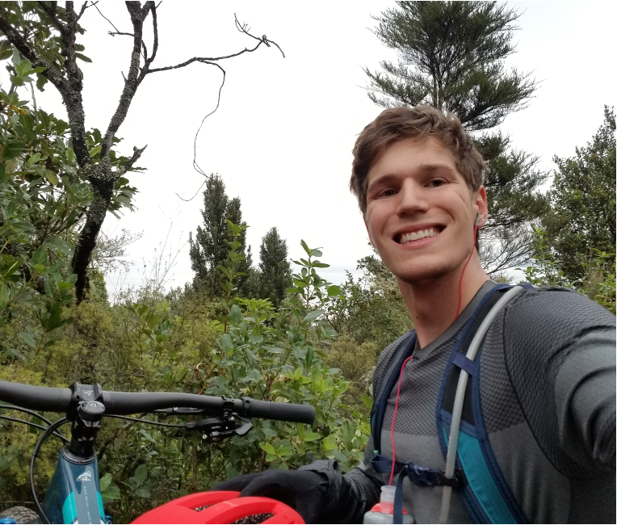
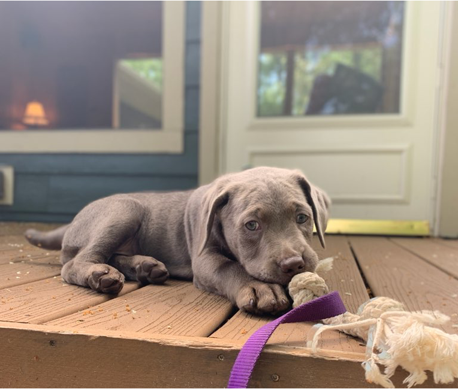

Durham, NC | lannersq@gmail.com | [Git](https://github.com/qlanners) | [LinkedIn](https://www.linkedin.com/in/quinn-lanners/)

---

- [Research & Projects](pages/research_and_projects.html)
- [Resume](quinn_resume.pdf)
- [Tutorial Posts](https://medium.com/@lannersq)

---

# About Me
My background is in mathematics, with a bachelors degree in applied math from [LMU](https://www.lmu.edu/) in Los Angeles. During my undergraduate studies, I became increasingly interested in machine learning and NLP in particular. I studied the theory and math behind the concepts of deep learning and recurrent neural networks. Since graduating, I have become a strong full-stack machine learning engineer, with experience in data collection, cleaning and analysis along with building, testing, deploying, and serving machine learning models.

I am hoping to pursue further education in the field of machine learning, with a desire to research and develop machine learning solutions rather than simply implement them.

Mountain Biking in New Zealand |  My lab puppy, Piper
:-----------------------------:|:-------------------------:
       |  